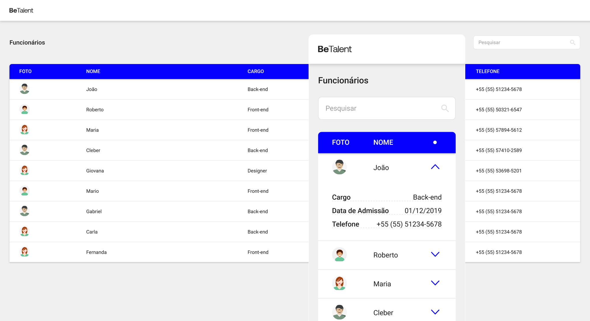

#  Teste Técnico Front-end BeTalent



<div>
    
    
    
</div>

O objetivo do teste técnico foi desenvolver uma aplicação front-end que consome dados de uma API simulada (via `json-server`) e exibe uma tabela responsiva com funcionalidades de pesquisa.

## Sobre o Projeto

O projeto consiste em uma interface de visualização de dados de usuários, apresentados em uma tabela com as seguintes colunas:

- **Imagem**: Thumbnail do usuário.
- **Nome**: Nome completo do usuário.
- **Cargo**: Cargo ocupado pelo usuário.
- **Data de Admissão**: Data em que o usuário foi admitido (formatada no front-end).
- **Telefone**: Número de telefone do usuário (formatado no front-end).

Além disso, a aplicação inclui um campo de pesquisa que permite filtrar os dados por **nome**, **cargo** ou **telefone**.

### Funcionalidades Principais

- Visualização responsiva da tabela (desktop e mobile).
- Formatação de datas e telefones diretamente no front-end.
- Filtragem dinâmica dos dados com base no input de pesquisa.
- Consumo de dados de uma API simulada (`json-server`).

---

## Pré-requisitos

Para rodar o projeto localmente, você precisará das seguintes ferramentas instaladas:

- **Node.js** (v16.x ou superior)
- **Yarn** ou **npm** (gerenciador de pacotes)

---

## Para Rodar a Aplicação

Siga os passos abaixo para rodar o projeto:

### 1. Clone o Repositório

```
git clone <URL do repositório>
```

### 2. Instale as Dependências

Navegue até o diretório do projeto e instale as dependências:

```bash
# Usando npm
npm install

# Ou usando yarn
yarn install
```

### 3. Inicie a API Simulada

Para iniciar a API simulada, execute o comando abaixo. Isso iniciará o `json-server` na porta **3001**, onde os dados estarão disponíveis em `http://localhost:3001`.

```bash
# Usando npm
npm run mock

# Usando yarn
yarn mock
```

> **Nota:** Certifique-se de que o servidor esteja rodando enquanto você executa a aplicação front-end.

### 4. Inicie a Aplicação Front-end

Com o servidor JSON rodando, inicie a aplicação front-end:

```bash
# Usando npm
npm run dev

# Usando yarn
yarn dev
```

A aplicação estará disponível em `http://localhost:5173`.

---

## Estrutura do Projeto

O projeto está organizado da seguinte forma:

```
src/
├── assets/           # Recursos visuais, como ícones e imagens
├── components/       # Componentes reutilizáveis da aplicação
├── data/             # Dados estáticos utilizados no projeto
├── services/         # Serviços de integração com a API simulada
├── styles/           # Estilos globais
├── types/            # Tipagem TypeScript para entidades do projeto
├── utils/            # Funções utilitárias reutilizáveis
```
